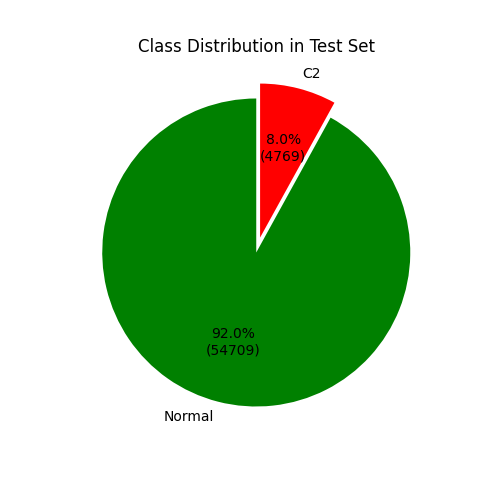
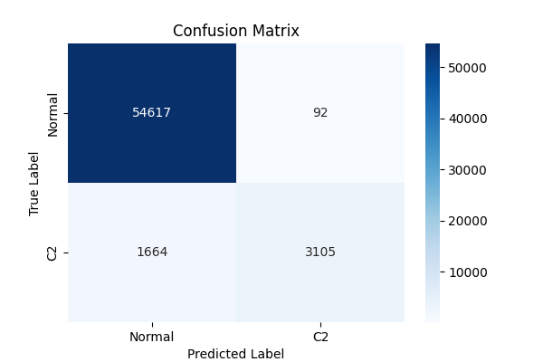
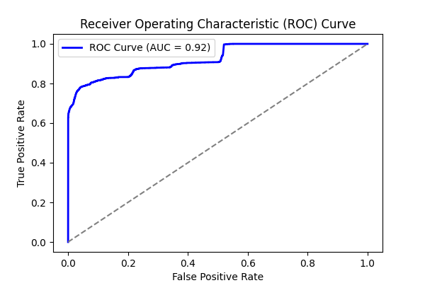
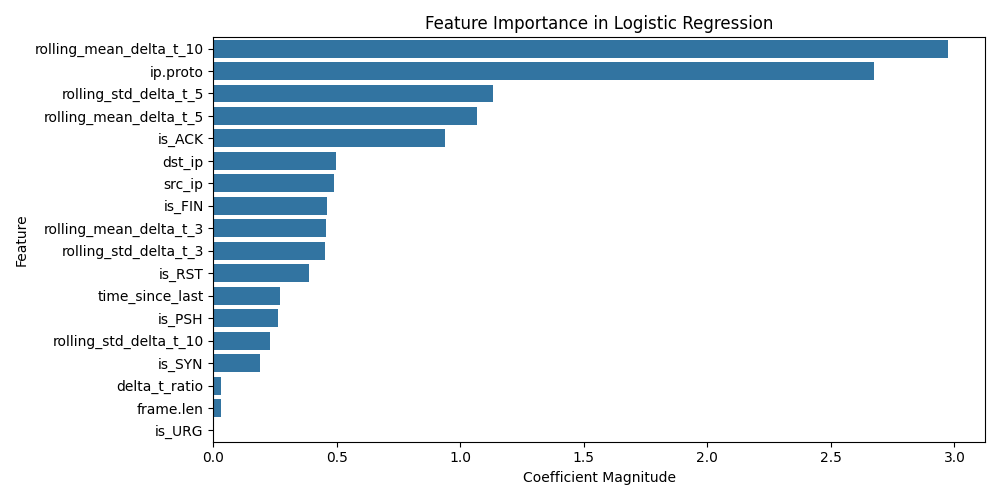
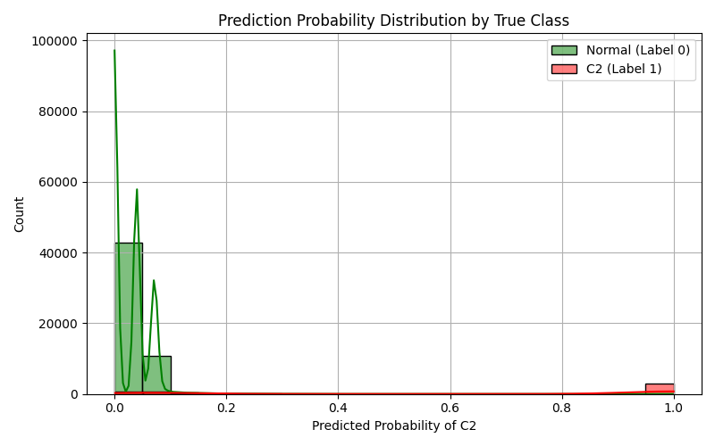

# Experiment Report: combined_0

- **Experiment ID:** combined_0_2025-04-01_09-30-55
- **Date:** 2025-04-01 09:30:57
- **Frameworks:** Metasploit, Covenant
## Notes
Includes normal and c2 traffic. Standard logistic regression model. 40% test split. Stratified sampling. Normalized features.

## Test Set Class Distribution


## Confusion Matrix


## Classification Report
```
              precision    recall  f1-score   support

           0       0.97      1.00      0.98     54709
           1       0.97      0.65      0.78      4769

    accuracy                           0.97     59478
   macro avg       0.97      0.82      0.88     59478
weighted avg       0.97      0.97      0.97     59478
```

## ROC Curve


## Feature Importance


## Prediction Probability Distribution by True Class

