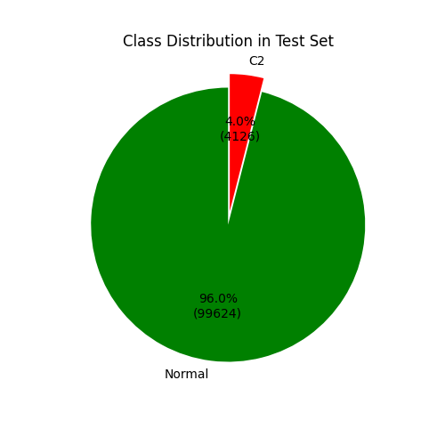
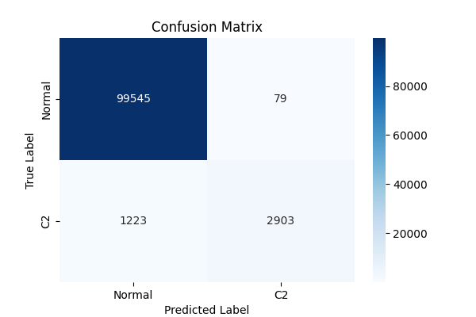
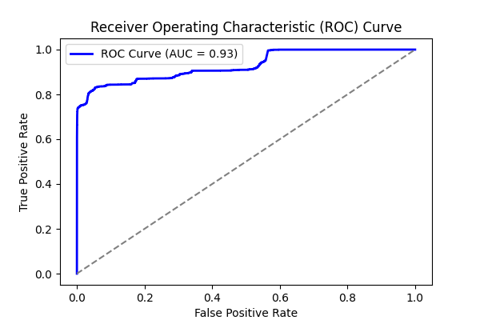
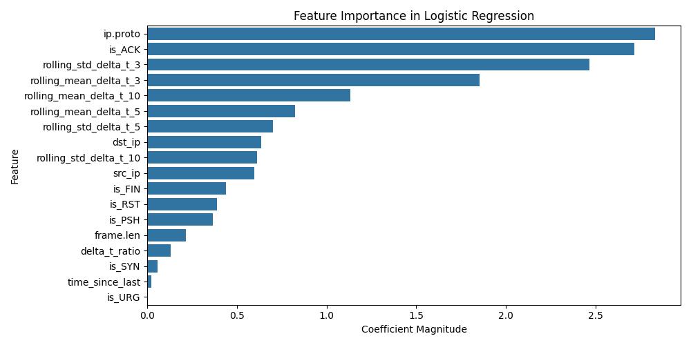
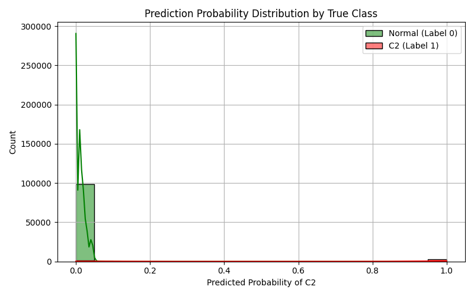

# Experiment Report: combined_1

- **Experiment ID:** combined_1_2025-04-01_10-10-16
- **Date:** 2025-04-01 10:10:17
- **Frameworks:** Metasploit, Covenant
## Notes
Includes normal and c2 traffic. Standard logistic regression model. 40% test split. Stratified sampling. Normalized features.

## Test Set Class Distribution


## Confusion Matrix


## Classification Report
```
              precision    recall  f1-score   support

           0       0.99      1.00      0.99     99624
           1       0.97      0.70      0.82      4126

    accuracy                           0.99    103750
   macro avg       0.98      0.85      0.91    103750
weighted avg       0.99      0.99      0.99    103750
```

## ROC Curve


## Feature Importance


## Prediction Probability Distribution by True Class

