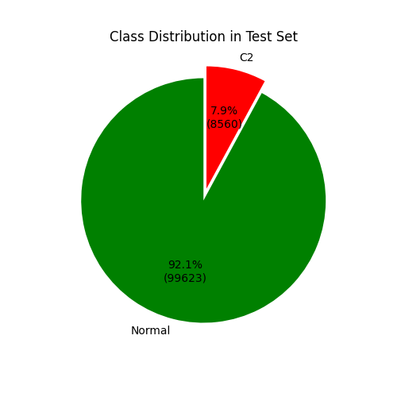
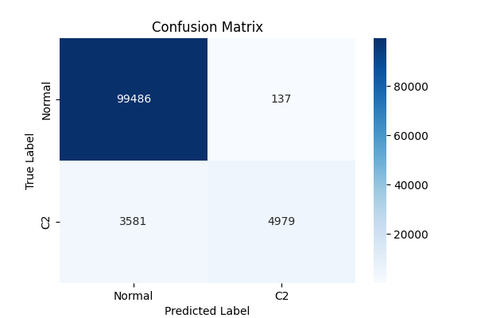
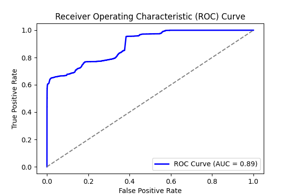
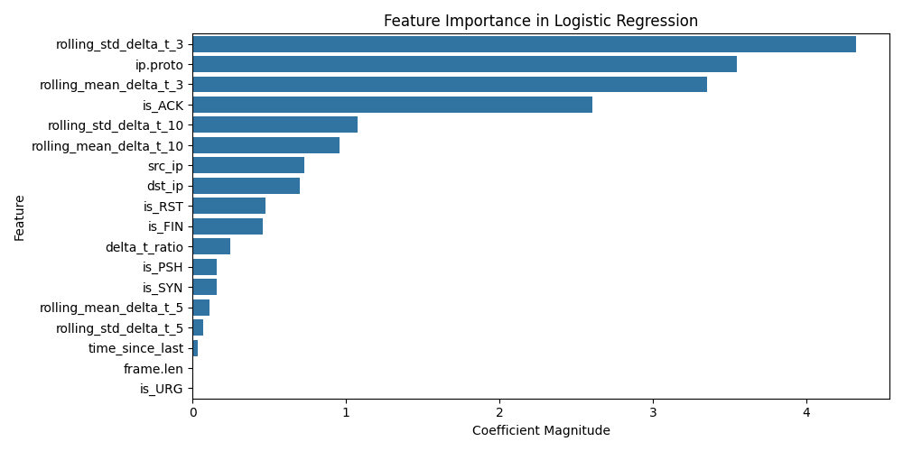
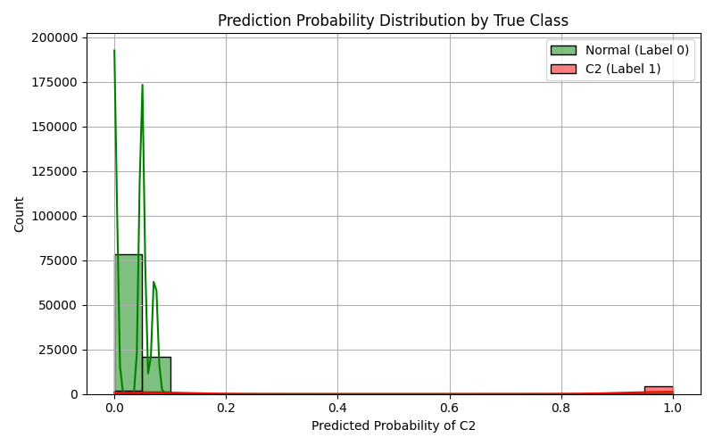

# Experiment Report: combined_1

- **Experiment ID:** combined_1_2025-04-08_12-03-22
- **Date:** 2025-04-08 12:03:24
- **Frameworks:** Metasploit, Covenant
## Notes
Includes normal and c2 traffic. Standard logistic regression model. 40% test split. Stratified sampling. Normalized features.

## Test Set Class Distribution


## Confusion Matrix


## Classification Report
```
              precision    recall  f1-score   support

           0       0.97      1.00      0.98     99623
           1       0.97      0.58      0.73      8560

    accuracy                           0.97    108183
   macro avg       0.97      0.79      0.85    108183
weighted avg       0.97      0.97      0.96    108183
```

## ROC Curve


## Feature Importance


## Prediction Probability Distribution by True Class

