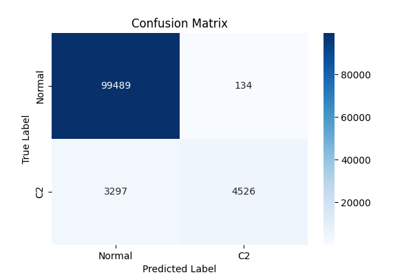
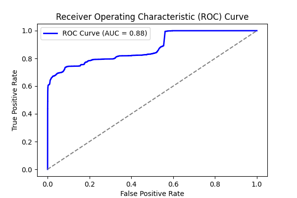
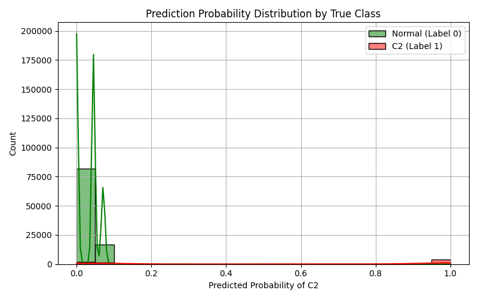

# Experiment Report: combined_2

- **Experiment ID:** combined_2_2025-04-01_12-40-20
- **Date:** 2025-04-01 12:40:23
- **Frameworks:** Metasploit, Covenant
## Notes
Includes normal and c2 traffic. Standard logistic regression model. 40% test split. Stratified sampling. Normalized features.

## Test Set Class Distribution


## Confusion Matrix


## Classification Report
```
              precision    recall  f1-score   support

           0       0.97      1.00      0.98     99623
           1       0.97      0.58      0.73      7823

    accuracy                           0.97    107446
   macro avg       0.97      0.79      0.85    107446
weighted avg       0.97      0.97      0.96    107446
```

## ROC Curve


## Feature Importance


## Prediction Probability Distribution by True Class

