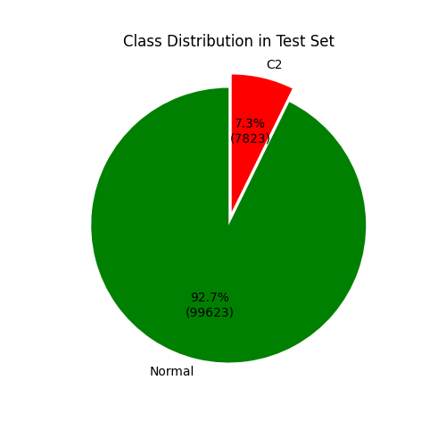
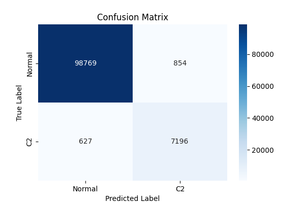
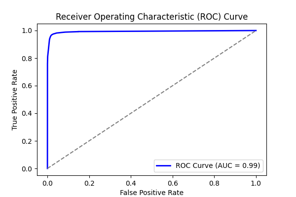
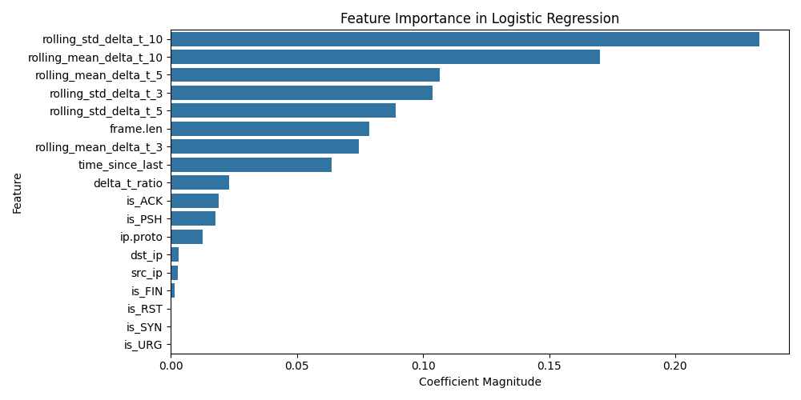
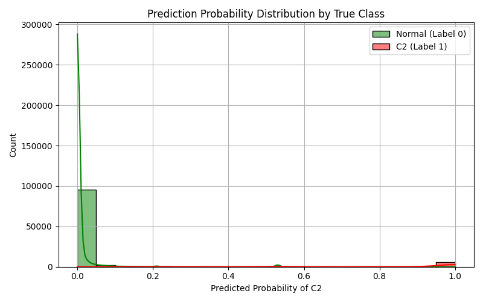

# Experiment Report: combined_2

- **Experiment ID:** combined_2_2025-04-01_13-04-12
- **Date:** 2025-04-01 13:04:14
- **Frameworks:** Metasploit, Covenant
## Notes
Includes normal and c2 traffic. Random Forest Classification. 40% test split. Stratified sampling. Normalized features.

## Test Set Class Distribution


## Confusion Matrix


## Classification Report
```
              precision    recall  f1-score   support

           0       0.99      0.99      0.99     99623
           1       0.89      0.92      0.91      7823

    accuracy                           0.99    107446
   macro avg       0.94      0.96      0.95    107446
weighted avg       0.99      0.99      0.99    107446
```

## ROC Curve


## Feature Importance


## Prediction Probability Distribution by True Class

