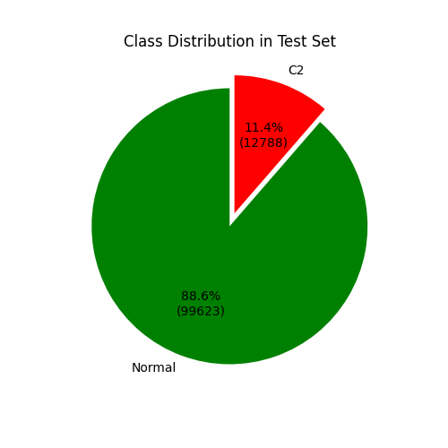
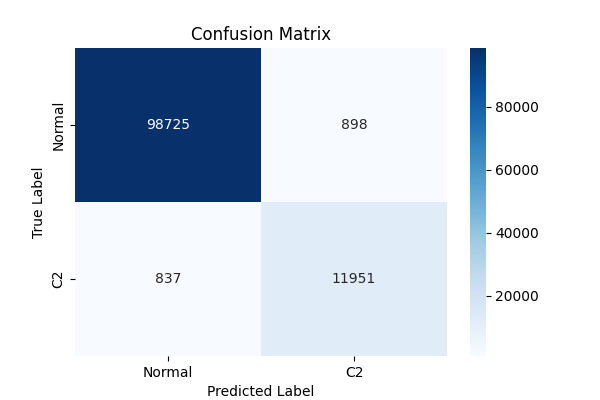
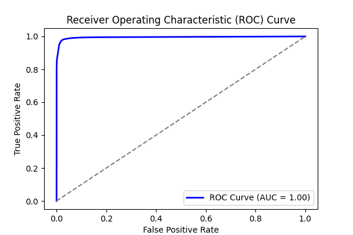
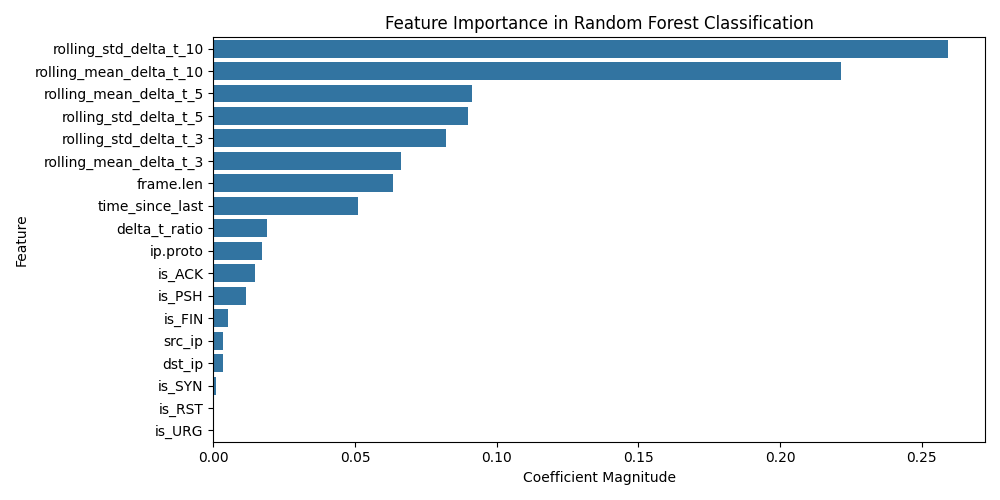
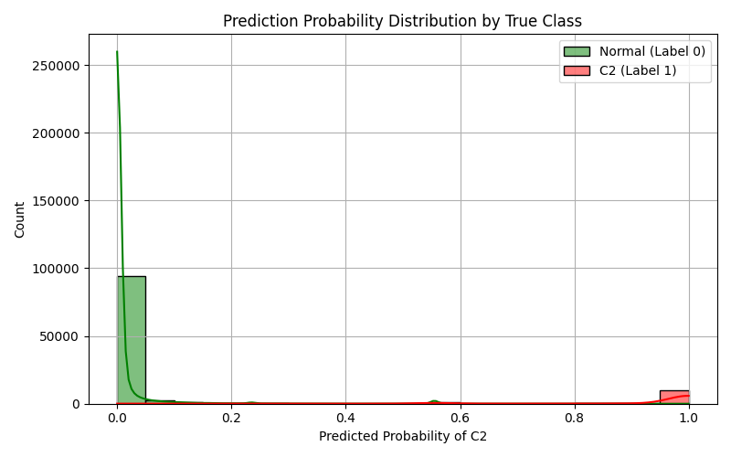

# Experiment Report: combined_2

- **Experiment ID:** combined_2_2025-04-08_12-13-35
- **Date:** 2025-04-08 12:13:37
- **Frameworks:** Metasploit, Covenant, Empire
## Notes
Includes normal and c2 traffic. Random Forest Classification. 40% test split. Stratified sampling. Normalized features.

## Test Set Class Distribution


## Confusion Matrix


## Classification Report
```
              precision    recall  f1-score   support

           0       0.99      0.99      0.99     99623
           1       0.93      0.93      0.93     12788

    accuracy                           0.98    112411
   macro avg       0.96      0.96      0.96    112411
weighted avg       0.98      0.98      0.98    112411
```

## ROC Curve


## Feature Importance


## Prediction Probability Distribution by True Class

