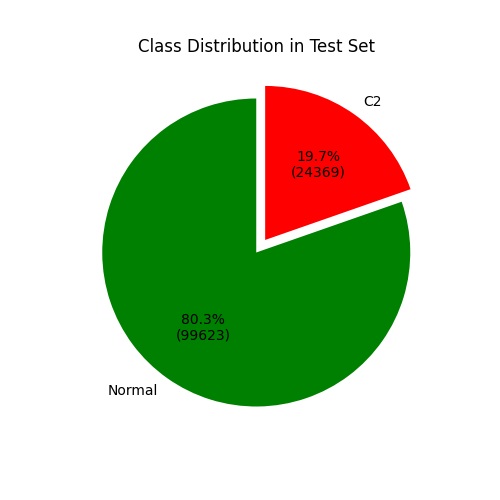
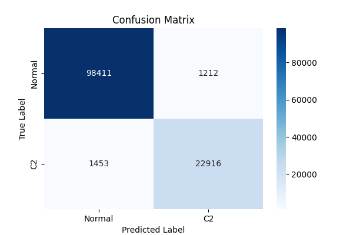
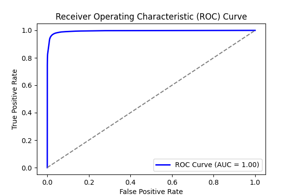
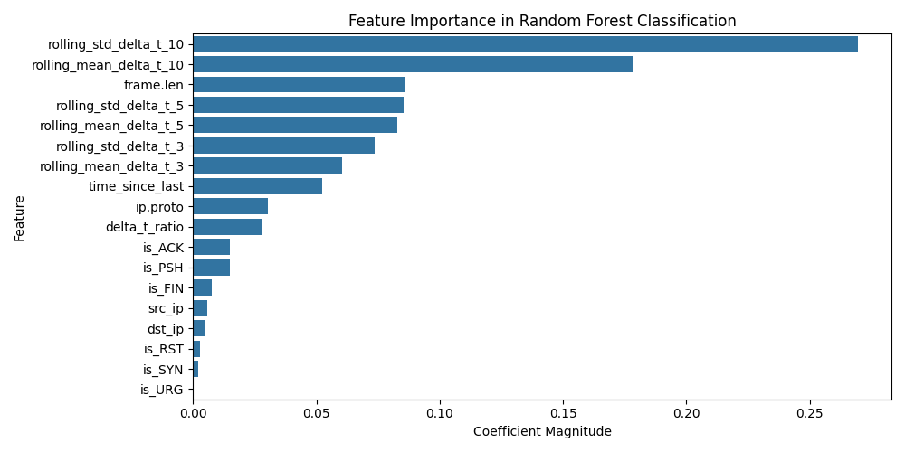
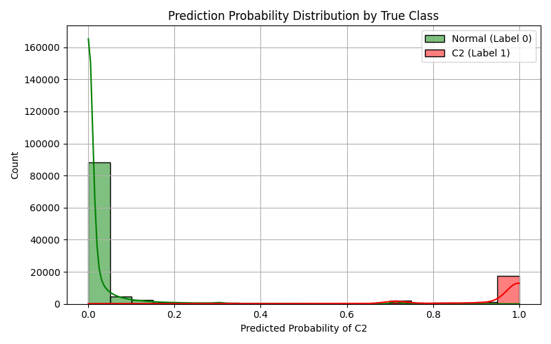

# Experiment Report: combined_5

- **Experiment ID:** combined_5_2025-04-11_00-49-12
- **Date:** 2025-04-11 00:49:14
- **Frameworks:** Metasploit, Covenant, Empire, Sliver, Merlin, Posh
## Notes
This is the complete dataset with traffic from all 6 C2 frameworks. Includes normal and c2 traffic. Random Forest Classification. 40% test split. Stratified sampling. Normalized features.

## Test Set Class Distribution


## Confusion Matrix


## Classification Report
```
              precision    recall  f1-score   support

           0       0.99      0.99      0.99     99623
           1       0.95      0.94      0.95     24369

    accuracy                           0.98    123992
   macro avg       0.97      0.96      0.97    123992
weighted avg       0.98      0.98      0.98    123992
```

## ROC Curve


## Feature Importance


## Prediction Probability Distribution by True Class

