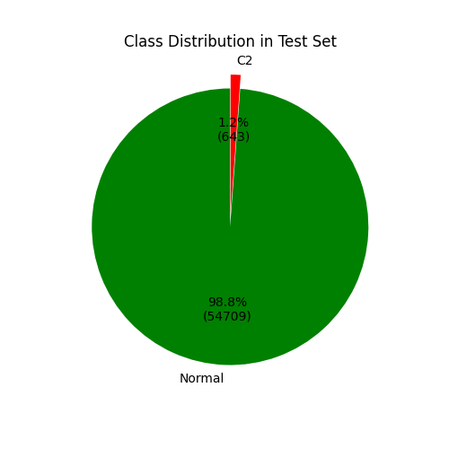
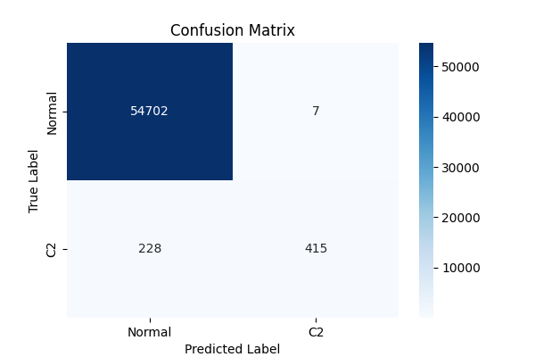
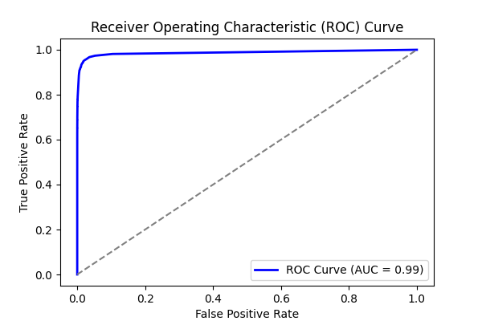
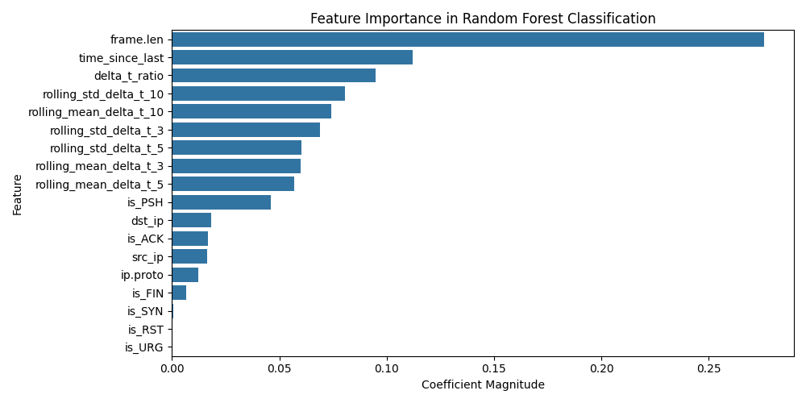
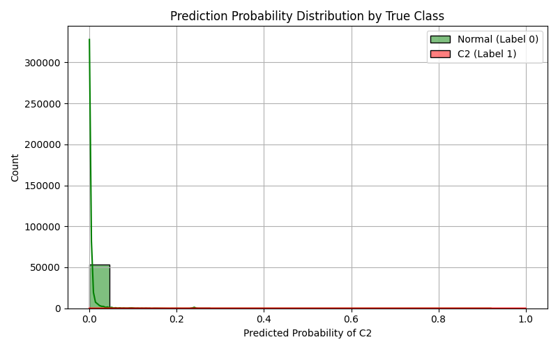

# Experiment Report: metasploit_mixed_0

- **Experiment ID:** metasploit_mixed_0_2025-04-12_20-34-34
- **Date:** 2025-04-12 20:34:35
- **Frameworks:** Metasploit

## Notes
Includes normal and c2 traffic. Random Forest Classification. 40% test split. Stratified sampling. Normalized features.

## Test Set Class Distribution


## Confusion Matrix


## Classification Report
```
              precision    recall  f1-score   support

           0       1.00      1.00      1.00     54709
           1       0.98      0.65      0.78       643

    accuracy                           1.00     55352
   macro avg       0.99      0.82      0.89     55352
weighted avg       1.00      1.00      1.00     55352
```

## ROC Curve


## Feature Importance


## Prediction Probability Distribution by True Class


---
## Model Artifacts
- Model file: `models\metasploit_mixed_0_rf_model.joblib`
- Scaler file: `models\metasploit_mixed_0_scaler.joblib`
- Feature list file: `models\metasploit_mixed_0_feature_columns.joblib`
