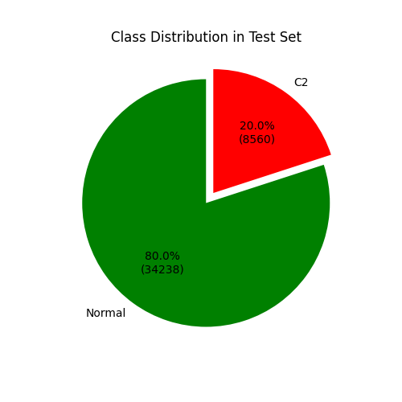
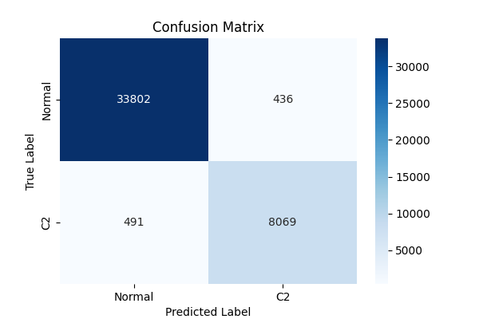
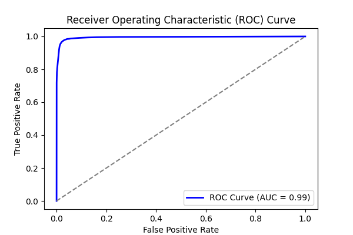
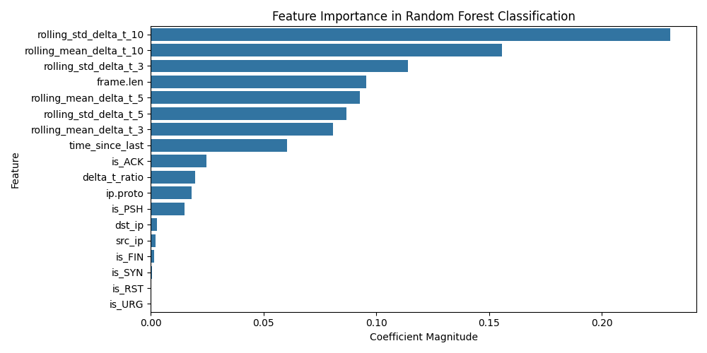
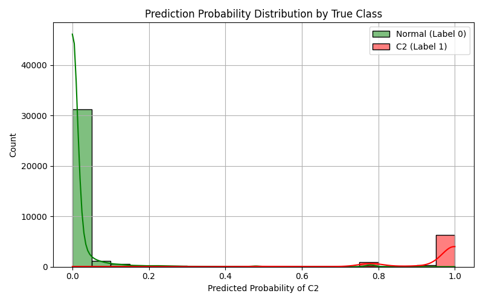

# Experiment Report: combined_1

- **Experiment ID:** combined_1_2025-04-11_15-26-57
- **Date:** 2025-04-11 15:26:59
- **Frameworks:** Metasploit, Covenant

## Notes
Includes c2 and normal traffic (20:80 ratio). Random Forest Classification. 40% test split. Stratified sampling. Normalized features.

## Test Set Class Distribution


## Confusion Matrix


## Classification Report
```
              precision    recall  f1-score   support

           0       0.99      0.99      0.99     34238
           1       0.95      0.94      0.95      8560

    accuracy                           0.98     42798
   macro avg       0.97      0.96      0.97     42798
weighted avg       0.98      0.98      0.98     42798
```

## ROC Curve


## Feature Importance


## Prediction Probability Distribution by True Class


---
## Model Artifacts
- Model file: `experiment_reports_20_80_ratio_enforced\models\combined_1_rf_model.joblib`
- Scaler file: `experiment_reports_20_80_ratio_enforced\models\combined_1_scaler.joblib`
- Feature list file: `experiment_reports_20_80_ratio_enforced\models\combined_1_feature_columns.joblib`
