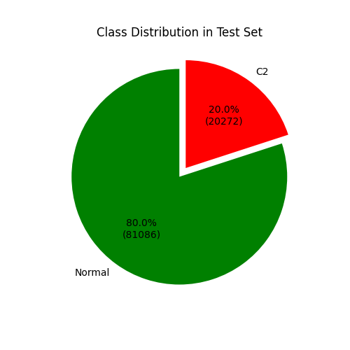
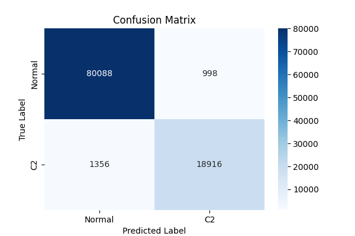
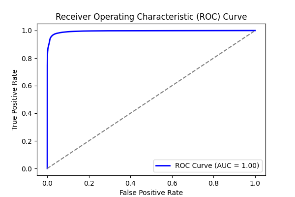
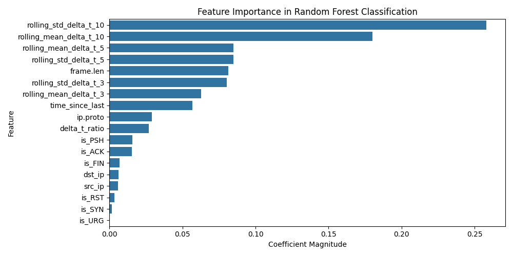
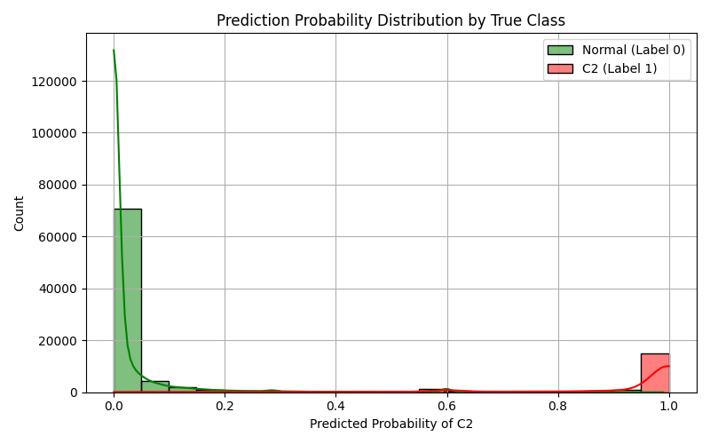

# Experiment Report: combined_4

- **Experiment ID:** combined_4_2025-04-11_15-22-47
- **Date:** 2025-04-11 15:22:49
- **Frameworks:** Metasploit, Covenant, Empire, Sliver, Merlin

## Notes
Includes c2 and normal traffic (20:80 ratio). Random Forest Classification. 40% test split. Stratified sampling. Normalized features.

## Test Set Class Distribution


## Confusion Matrix


## Classification Report
```
              precision    recall  f1-score   support

           0       0.98      0.99      0.99     81086
           1       0.95      0.93      0.94     20272

    accuracy                           0.98    101358
   macro avg       0.97      0.96      0.96    101358
weighted avg       0.98      0.98      0.98    101358
```

## ROC Curve


## Feature Importance


## Prediction Probability Distribution by True Class


---
## Model Artifacts
- Model file: `experiment_reports_20_80_ratio_enforced\models\combined_4_rf_model.joblib`
- Scaler file: `experiment_reports_20_80_ratio_enforced\models\combined_4_scaler.joblib`
- Feature list file: `experiment_reports_20_80_ratio_enforced\models\combined_4_feature_columns.joblib`
