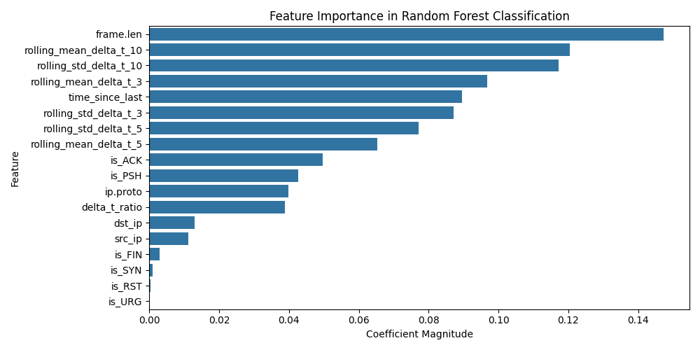

# Experiment Report: metasploit_mixed_0

- **Experiment ID:** metasploit_mixed_0_2025-04-12_20-25-05
- **Date:** 2025-04-12 20:25:06
- **Frameworks:** Metasploit

## Notes
Includes c2 and normal traffic (20:80 ratio). Random Forest Classification. 40% test split. Stratified sampling. Normalized features.

## Test Set Class Distribution


## Confusion Matrix


## Classification Report
```
              precision    recall  f1-score   support

           0       0.98      0.99      0.98      2571
           1       0.94      0.90      0.92       643

    accuracy                           0.97      3214
   macro avg       0.96      0.94      0.95      3214
weighted avg       0.97      0.97      0.97      3214
```

## ROC Curve


## Feature Importance


## Prediction Probability Distribution by True Class


---
## Model Artifacts
- Model file: `experiment_reports_20_80_ratio_enforced\models\metasploit_mixed_0_rf_model.joblib`
- Scaler file: `experiment_reports_20_80_ratio_enforced\models\metasploit_mixed_0_scaler.joblib`
- Feature list file: `experiment_reports_20_80_ratio_enforced\models\metasploit_mixed_0_feature_columns.joblib`
