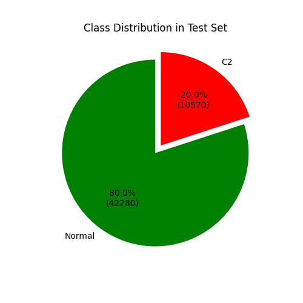
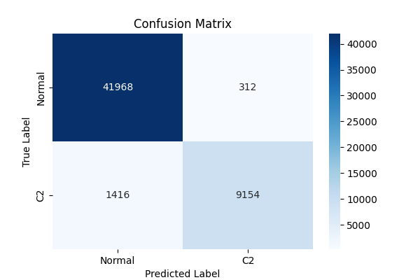
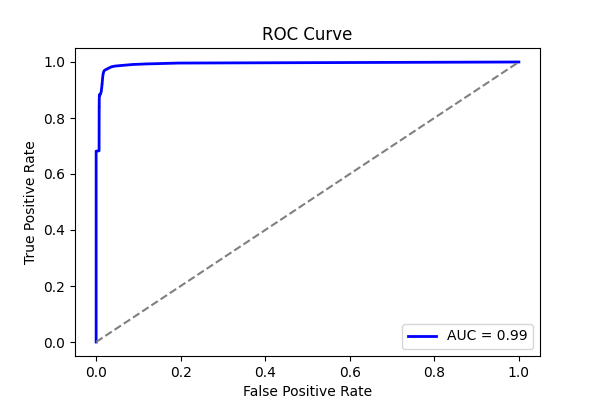
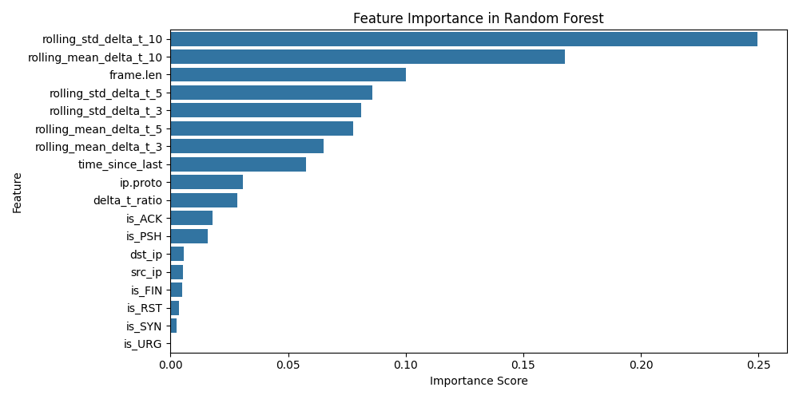
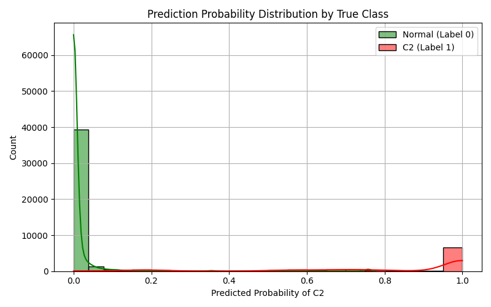

# LOGO Report: LOGO_empire

- **Experiment ID:** LOGO_empire_2025-04-11_14-11-26
- **Date:** 2025-04-11 14:11:28
- **Frameworks (Train):** Metasploit, Covenant, Sliver, Merlin, Posh
- **Framework (Test):** empire

## Notes
Leave-One-Group-Out (LOGO) evaluation: the test set includes C2 traffic from the held-out empire framework, combined with sampled normal traffic (80:20 ratio). The training set includes C2 traffic from the remaining frameworks and sampled normal traffic, also at 80:20. This setup tests how well the model generalizes to unseen C2 traffic under realistic class distributions.

## Test Set Class Distribution


## Confusion Matrix


## Classification Report
```
              precision    recall  f1-score   support

           0       0.97      0.99      0.98     42280
           1       0.97      0.87      0.91     10570

    accuracy                           0.97     52850
   macro avg       0.97      0.93      0.95     52850
weighted avg       0.97      0.97      0.97     52850
```

## ROC Curve


## Feature Importance


## Prediction Probability Distribution by True Class

