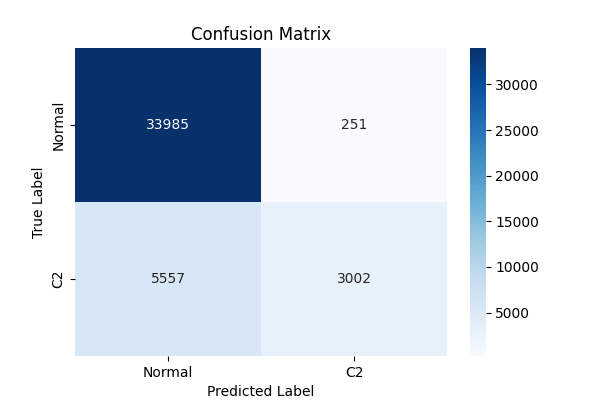
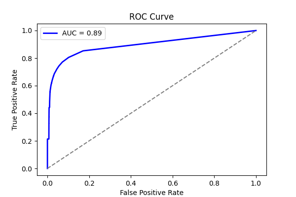
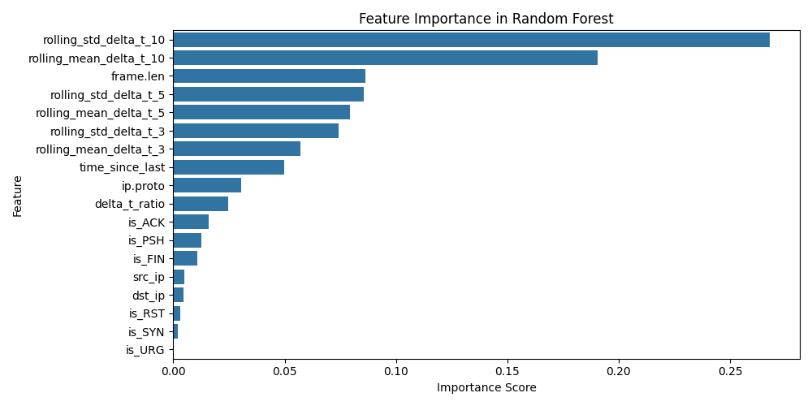
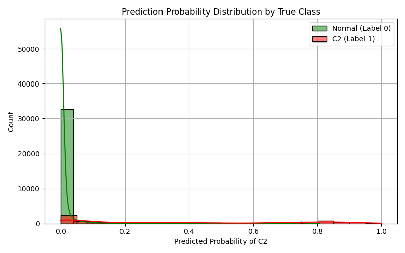

# LOGO Report: LOGO_merlin

- **Experiment ID:** LOGO_merlin_2025-04-11_14-06-50
- **Date:** 2025-04-11 14:06:52
- **Frameworks (Train):** Metasploit, Covenant, Empire, Sliver, Posh
- **Framework (Test):** merlin

## Notes
Leave-One-Group-Out (LOGO) evaluation: the test set includes C2 traffic from the held-out merlin framework, combined with sampled normal traffic (80:20 ratio). The training set includes C2 traffic from the remaining frameworks and sampled normal traffic, also at 80:20. This setup tests how well the model generalizes to unseen C2 traffic under realistic class distributions.

## Test Set Class Distribution


## Confusion Matrix


## Classification Report
```
              precision    recall  f1-score   support

           0       0.86      0.99      0.92     34236
           1       0.92      0.35      0.51      8559

    accuracy                           0.86     42795
   macro avg       0.89      0.67      0.71     42795
weighted avg       0.87      0.86      0.84     42795
```

## ROC Curve


## Feature Importance


## Prediction Probability Distribution by True Class

