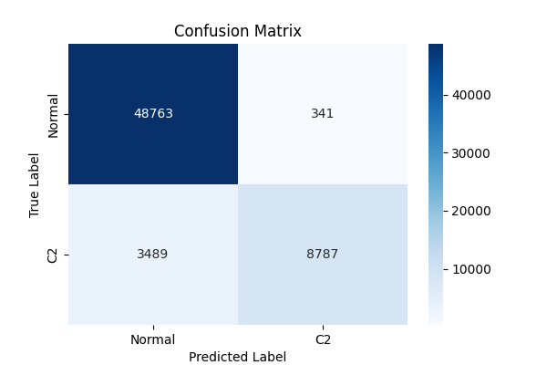
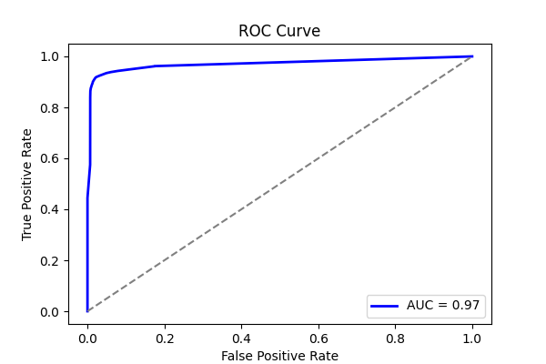
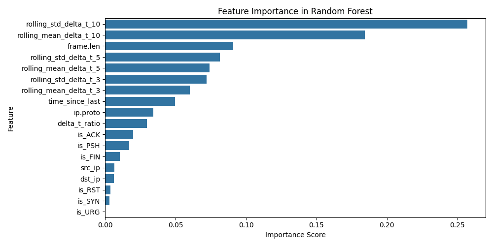
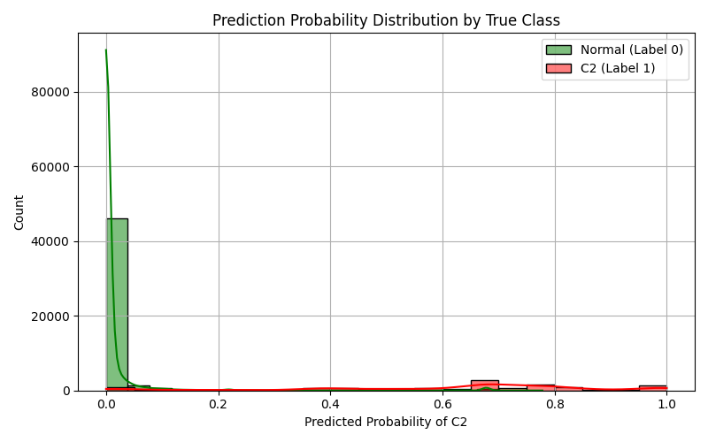

# LOGO Report: LOGO_covenant

- **Experiment ID:** LOGO_covenant_2025-04-11_14-13-13
- **Date:** 2025-04-11 14:13:15
- **Frameworks (Train):** Metasploit, Empire, Sliver, Merlin, Posh
- **Framework (Test):** covenant

## Notes
Leave-One-Group-Out (LOGO) evaluation: the test set includes C2 traffic from the held-out covenant framework, combined with sampled normal traffic (80:20 ratio). The training set includes C2 traffic from the remaining frameworks and sampled normal traffic, also at 80:20. This setup tests how well the model generalizes to unseen C2 traffic under realistic class distributions.

## Test Set Class Distribution


## Confusion Matrix


## Classification Report
```
              precision    recall  f1-score   support

           0       0.93      0.99      0.96     49104
           1       0.96      0.72      0.82     12276

    accuracy                           0.94     61380
   macro avg       0.95      0.85      0.89     61380
weighted avg       0.94      0.94      0.93     61380
```

## ROC Curve


## Feature Importance


## Prediction Probability Distribution by True Class

