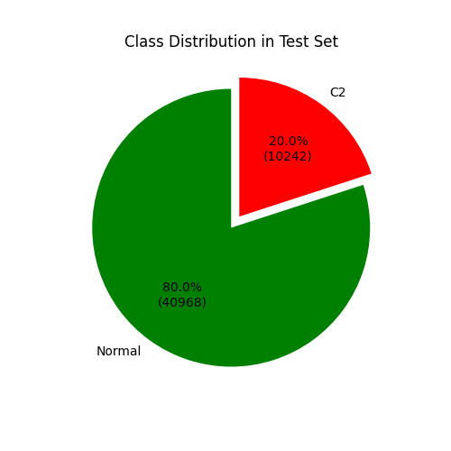
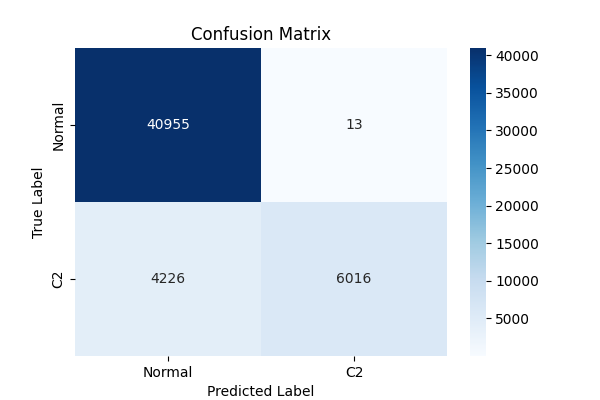
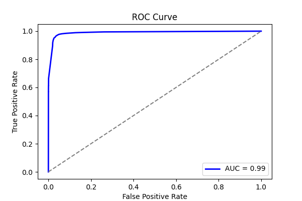
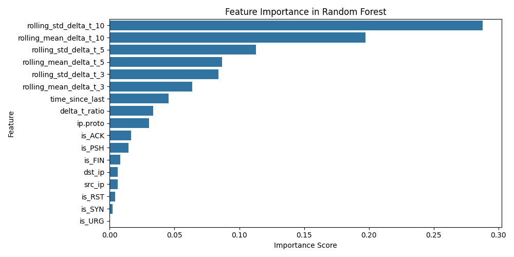
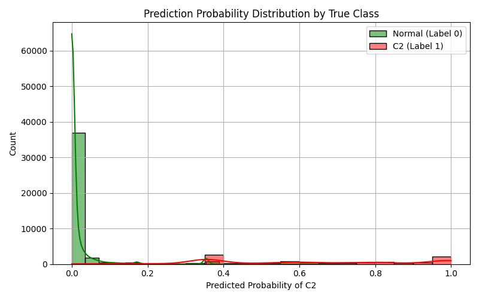

# LOGO Report: LOGO_posh

- **Experiment ID:** LOGO_posh_2025-04-11_15-49-53
- **Date:** 2025-04-11 15:49:54
- **Frameworks (Train):** Covenant, Empire, Sliver, Merlin, Metasploit
- **Framework (Test):** posh

## Notes
Leave-One-Group-Out (LOGO) evaluation: the test set includes C2 traffic from the held-out posh framework, combined with sampled normal traffic (80:20 ratio). The training set includes C2 traffic from the remaining frameworks and sampled normal traffic, also at 80:20. This setup tests how well the model generalizes to unseen C2 traffic under realistic class distributions.

## Test Set Class Distribution


## Confusion Matrix


## Classification Report
```
              precision    recall  f1-score   support

           0       0.91      1.00      0.95     40968
           1       1.00      0.59      0.74     10242

    accuracy                           0.92     51210
   macro avg       0.95      0.79      0.85     51210
weighted avg       0.92      0.92      0.91     51210
```

## ROC Curve


## Feature Importance


## Prediction Probability Distribution by True Class

