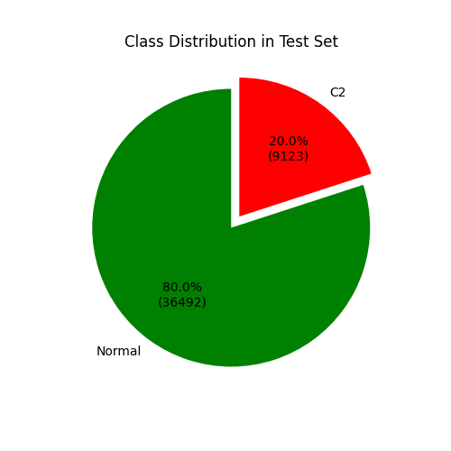
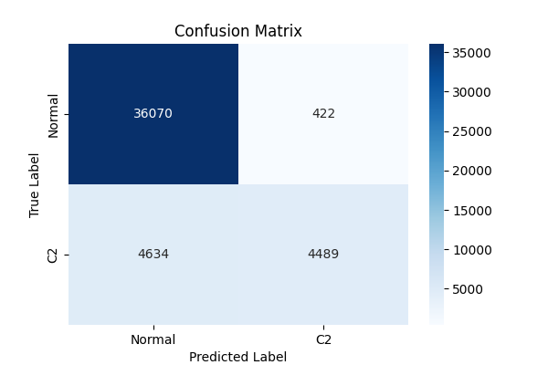
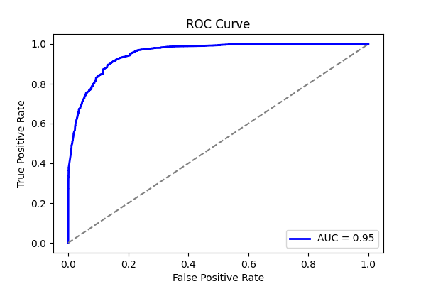
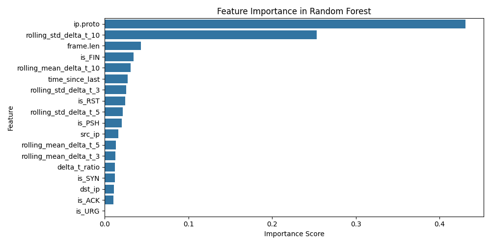
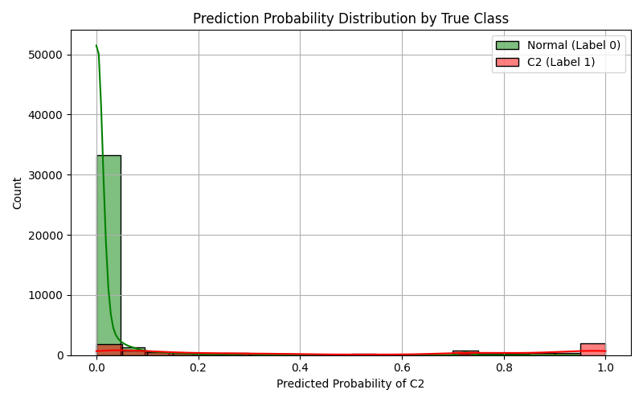

# LOGO Report: LOGO_metasploit

- **Experiment ID:** LOGO_metasploit_2025-04-11_14-47-35
- **Date:** 2025-04-11 14:47:36
- **Frameworks (Train):** Covenant, Empire, Sliver, Merlin, Posh
- **Framework (Test):** metasploit

## Notes
Leave-One-Group-Out (LOGO) evaluation: the test set includes C2 traffic from the held-out metasploit framework, combined with sampled normal traffic (80:20 ratio). The training set includes C2 traffic from the remaining frameworks and sampled normal traffic, also at 80:20. This setup tests how well the model generalizes to unseen C2 traffic under realistic class distributions. This uses XGBoost

## Test Set Class Distribution


## Confusion Matrix


## Classification Report
```
              precision    recall  f1-score   support

           0       0.89      0.99      0.93     36492
           1       0.91      0.49      0.64      9123

    accuracy                           0.89     45615
   macro avg       0.90      0.74      0.79     45615
weighted avg       0.89      0.89      0.88     45615
```

## ROC Curve


## Feature Importance


## Prediction Probability Distribution by True Class

