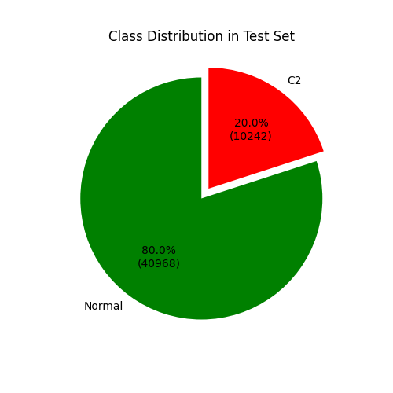
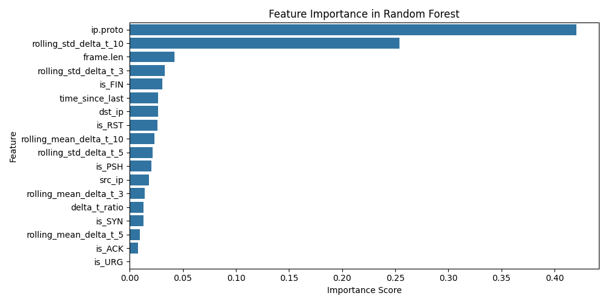

# LOGO Report: LOGO_posh

- **Experiment ID:** LOGO_posh_2025-04-11_14-51-58
- **Date:** 2025-04-11 14:51:59
- **Frameworks (Train):** Metasploit, Covenant, Empire, Sliver, Merlin
- **Framework (Test):** posh

## Notes
Leave-One-Group-Out (LOGO) evaluation: the test set includes C2 traffic from the held-out posh framework, combined with sampled normal traffic (80:20 ratio). The training set includes C2 traffic from the remaining frameworks and sampled normal traffic, also at 80:20. This setup tests how well the model generalizes to unseen C2 traffic under realistic class distributions. This uses XGBoost

## Test Set Class Distribution


## Confusion Matrix


## Classification Report
```
              precision    recall  f1-score   support

           0       0.97      0.99      0.98     40968
           1       0.95      0.90      0.92     10242

    accuracy                           0.97     51210
   macro avg       0.96      0.94      0.95     51210
weighted avg       0.97      0.97      0.97     51210
```

## ROC Curve


## Feature Importance


## Prediction Probability Distribution by True Class

