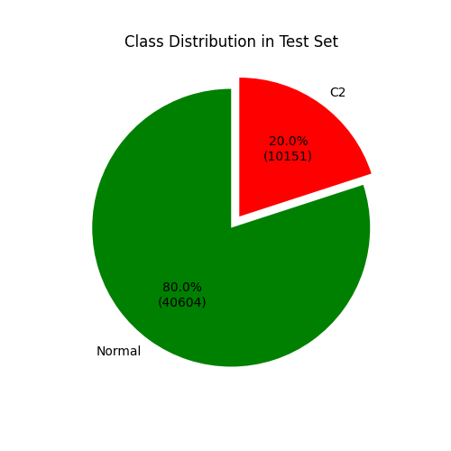
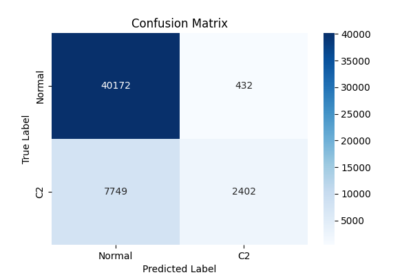
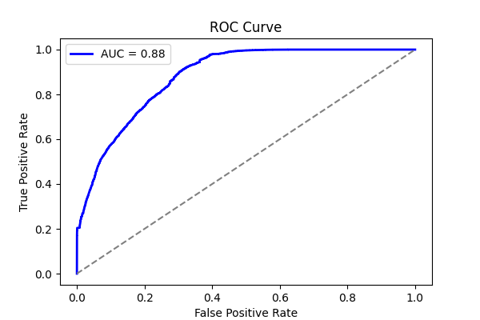
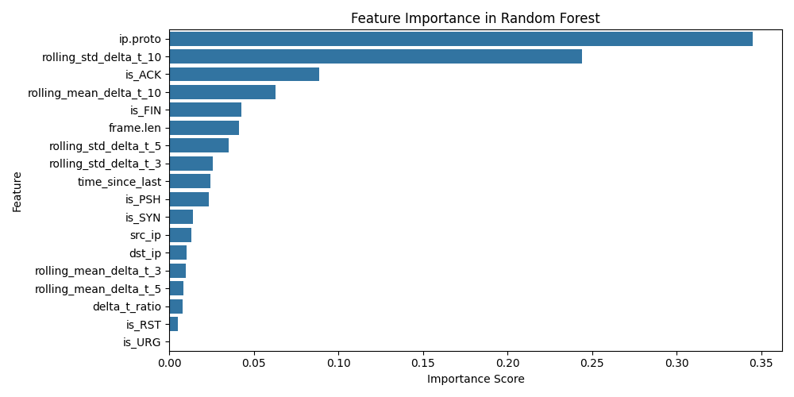
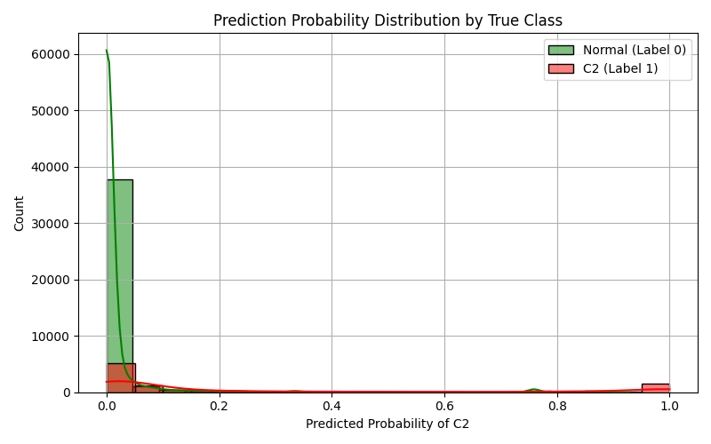

# LOGO Report: LOGO_sliver

- **Experiment ID:** LOGO_sliver_2025-04-11_14-50-24
- **Date:** 2025-04-11 14:50:25
- **Frameworks (Train):** Metasploit, Covenant, Empire, Merlin, Posh
- **Framework (Test):** sliver

## Notes
Leave-One-Group-Out (LOGO) evaluation: the test set includes C2 traffic from the held-out sliver framework, combined with sampled normal traffic (80:20 ratio). The training set includes C2 traffic from the remaining frameworks and sampled normal traffic, also at 80:20. This setup tests how well the model generalizes to unseen C2 traffic under realistic class distributions. This uses XGBoost

## Test Set Class Distribution


## Confusion Matrix


## Classification Report
```
              precision    recall  f1-score   support

           0       0.84      0.99      0.91     40604
           1       0.85      0.24      0.37     10151

    accuracy                           0.84     50755
   macro avg       0.84      0.61      0.64     50755
weighted avg       0.84      0.84      0.80     50755
```

## ROC Curve


## Feature Importance


## Prediction Probability Distribution by True Class

