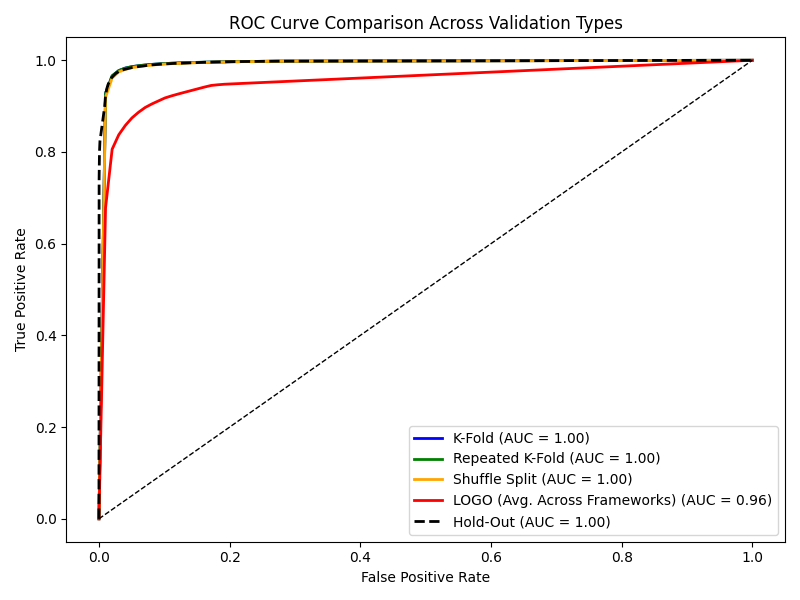

# Validation Summary Report

**Generated:** 2025-04-11 23:05:48

## Full Model Evaluation (Hold-Out)

- Accuracy: `0.9778`
- AUC: `0.9953`

### Classification Report
```
              precision    recall  f1-score   support

           0       0.98      0.99      0.99     97474
           1       0.95      0.94      0.94     24368

    accuracy                           0.98    121842
   macro avg       0.97      0.96      0.97    121842
weighted avg       0.98      0.98      0.98    121842
```

### ROC Curve


### Feature Importance


### Prediction Probability Distribution


## Generalization to Metasploit (LOGO)

- Accuracy: `0.8863`
- AUC: `0.9771`

### Classification Report
```
              precision    recall  f1-score   support

           0       0.88      0.99      0.93     36492
           1       0.94      0.46      0.62      9123

    accuracy                           0.89     45615
   macro avg       0.91      0.73      0.78     45615
weighted avg       0.89      0.89      0.87     45615
```

## Generalization to Covenant (LOGO)

- Accuracy: `0.9376`
- AUC: `0.9710`

### Classification Report
```
              precision    recall  f1-score   support

           0       0.93      0.99      0.96     49104
           1       0.96      0.72      0.82     12276

    accuracy                           0.94     61380
   macro avg       0.95      0.85      0.89     61380
weighted avg       0.94      0.94      0.93     61380
```

## Generalization to Empire (LOGO)

- Accuracy: `0.9673`
- AUC: `0.9936`

### Classification Report
```
              precision    recall  f1-score   support

           0       0.97      0.99      0.98     42280
           1       0.97      0.87      0.91     10570

    accuracy                           0.97     52850
   macro avg       0.97      0.93      0.95     52850
weighted avg       0.97      0.97      0.97     52850
```

## Generalization to Sliver (LOGO)

- Accuracy: `0.8328`
- AUC: `0.9015`

### Classification Report
```
              precision    recall  f1-score   support

           0       0.83      0.99      0.90     40604
           1       0.87      0.19      0.32     10151

    accuracy                           0.83     50755
   macro avg       0.85      0.59      0.61     50755
weighted avg       0.84      0.83      0.79     50755
```

## Generalization to Merlin (LOGO)

- Accuracy: `0.8643`
- AUC: `0.8945`

### Classification Report
```
              precision    recall  f1-score   support

           0       0.86      0.99      0.92     34236
           1       0.92      0.35      0.51      8559

    accuracy                           0.86     42795
   macro avg       0.89      0.67      0.71     42795
weighted avg       0.87      0.86      0.84     42795
```

## Generalization to Posh (LOGO)

- Accuracy: `0.9642`
- AUC: `0.9957`

### Classification Report
```
              precision    recall  f1-score   support

           0       0.96      0.99      0.98     40968
           1       0.97      0.85      0.90     10242

    accuracy                           0.96     51210
   macro avg       0.97      0.92      0.94     51210
weighted avg       0.96      0.96      0.96     51210
```

## ROC Curve Comparison



---
## Validation Metrics Summary (Folded Methods Use Mean Values)

| Run             |   F1 (C2) |   Recall (C2) |      AUC |
|:----------------|----------:|--------------:|---------:|
| Hold-Out        |  0.944186 |      0.936843 | 0.995302 |
| K-Fold          |  0.946499 |      0.940865 | 0.995664 |
| Repeated K-Fold |  0.94843  |      0.941891 | 0.995695 |
| LOGO_metasploit |  0.618687 |      0.461252 | 0.977084 |
| LOGO_covenant   |  0.821061 |      0.715787 | 0.97097  |
| LOGO_empire     |  0.913755 |      0.866036 | 0.99355  |
| LOGO_sliver     |  0.316366 |      0.193478 | 0.901524 |
| LOGO_merlin     |  0.508297 |      0.350742 | 0.894491 |
| LOGO_posh       |  0.904861 |      0.850615 | 0.99573  |
