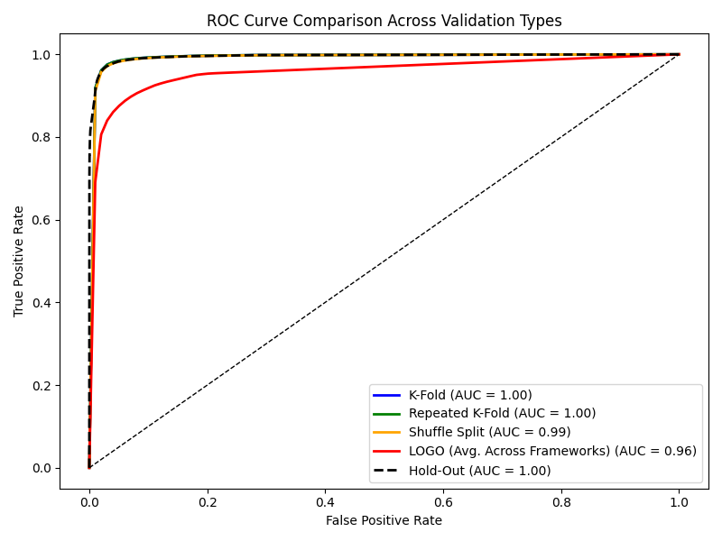

# Validation Summary Report

**Generated:** 2025-05-19 20:49:58

## Full Model Evaluation (Hold-Out)

- Accuracy: `0.9762`
- AUC: `0.9950`

### Classification Report
```
              precision    recall  f1-score   support

           0       0.98      0.99      0.99     99623
           1       0.95      0.94      0.94     26420

    accuracy                           0.98    126043
   macro avg       0.97      0.96      0.96    126043
weighted avg       0.98      0.98      0.98    126043
```

### ROC Curve


### Feature Importance


### Prediction Probability Distribution


## Generalization to Metasploit (LOGO)

- Accuracy: `0.9127`
- AUC: `0.9741`

### Classification Report
```
              precision    recall  f1-score   support

           0       0.91      0.99      0.95     42568
           1       0.95      0.59      0.73     10642

    accuracy                           0.91     53210
   macro avg       0.93      0.79      0.84     53210
weighted avg       0.92      0.91      0.90     53210
```

## Generalization to Covenant (LOGO)

- Accuracy: `0.9574`
- AUC: `0.9731`

### Classification Report
```
              precision    recall  f1-score   support

           0       0.96      0.99      0.97     53828
           1       0.96      0.82      0.88     13457

    accuracy                           0.96     67285
   macro avg       0.96      0.90      0.93     67285
weighted avg       0.96      0.96      0.96     67285
```

## Generalization to Empire (LOGO)

- Accuracy: `0.9643`
- AUC: `0.9937`

### Classification Report
```
              precision    recall  f1-score   support

           0       0.96      0.99      0.98     47300
           1       0.96      0.85      0.91     11825

    accuracy                           0.96     59125
   macro avg       0.96      0.92      0.94     59125
weighted avg       0.96      0.96      0.96     59125
```

## Generalization to Sliver (LOGO)

- Accuracy: `0.8374`
- AUC: `0.9108`

### Classification Report
```
              precision    recall  f1-score   support

           0       0.84      0.99      0.91     48932
           1       0.88      0.22      0.35     12233

    accuracy                           0.84     61165
   macro avg       0.86      0.61      0.63     61165
weighted avg       0.84      0.84      0.80     61165
```

## Generalization to Merlin (LOGO)

- Accuracy: `0.8761`
- AUC: `0.9037`

### Classification Report
```
              precision    recall  f1-score   support

           0       0.87      0.99      0.93     38252
           1       0.93      0.41      0.57      9563

    accuracy                           0.88     47815
   macro avg       0.90      0.70      0.75     47815
weighted avg       0.88      0.88      0.86     47815
```

## Generalization to Posh (LOGO)

- Accuracy: `0.9711`
- AUC: `0.9961`

### Classification Report
```
              precision    recall  f1-score   support

           0       0.97      0.99      0.98     45664
           1       0.97      0.89      0.92     11416

    accuracy                           0.97     57080
   macro avg       0.97      0.94      0.95     57080
weighted avg       0.97      0.97      0.97     57080
```

## ROC Curve Comparison



---
## Validation Metrics Summary (Folds and Shuffle Runs Averaged)

| Run             |   F1 (C2) |   Recall (C2) |      AUC |
|:----------------|----------:|--------------:|---------:|
| Hold-Out        |  0.942911 |      0.935844 | 0.995013 |
| K-Fold          |  0.944931 |      0.938032 | 0.99536  |
| Shuffle Split   |  0.942154 |      0.934769 | 0.994823 |
| LOGO_metasploit |  0.731114 |      0.593403 | 0.974144 |
| LOGO_covenant   |  0.884796 |      0.817567 | 0.97307  |
| LOGO_empire     |  0.905345 |      0.852939 | 0.993741 |
| LOGO_sliver     |  0.348782 |      0.217772 | 0.91077  |
| LOGO_merlin     |  0.570476 |      0.411377 | 0.903667 |
| LOGO_posh       |  0.924757 |      0.886563 | 0.996098 |
